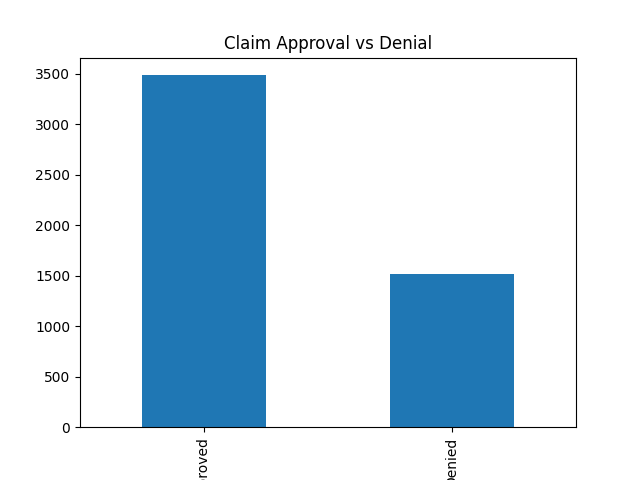

# Healthcare RCM Workflow Analysis

This project simulates a Revenue Cycle Management (RCM) workflow and analyzes claim processing efficiency.

## Objective

To identify inefficiencies in claim approval and denial workflows and suggest data-driven improvements.

## Key Metrics

- Denial Rate
- Claim Approval Rate
- Reprocessing Efficiency

## Insights

- High denial rates indicate workflow inefficiencies
- Coding errors and missing information are key drivers of claim denial
- Improving upstream validation can reduce revenue leakage

## Business Impact

Reducing denial rate by even 5% can significantly improve revenue realization.

## Visualization

